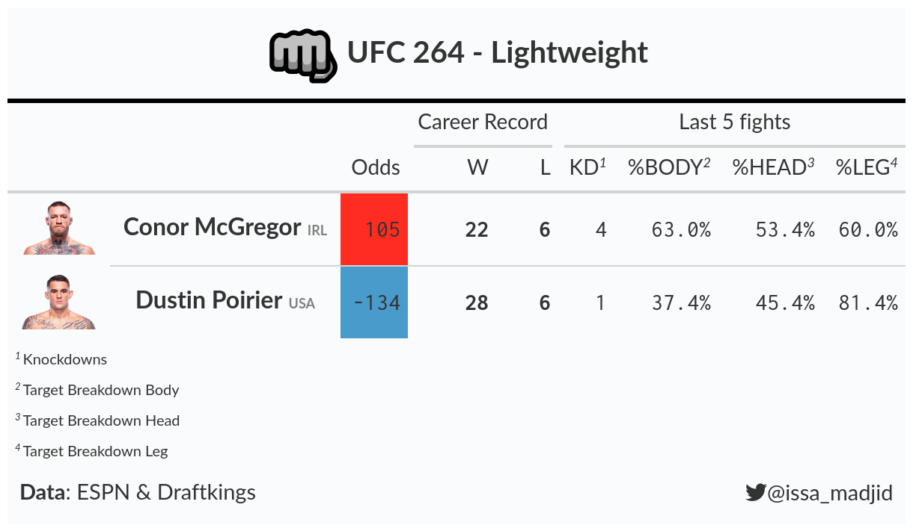

This repository contains code to scrape UFC figthers datasets  and stats from ESPN website.
There is also a boiler plate code to generate an UFC fight summary table with [gt](https://gt.rstudio.com/) inspred by  a [Thomas Mock](https://gist.github.com/jthomasmock/4a8851d74d911ce9b90bf7a43c4cdf47) gist post. 

